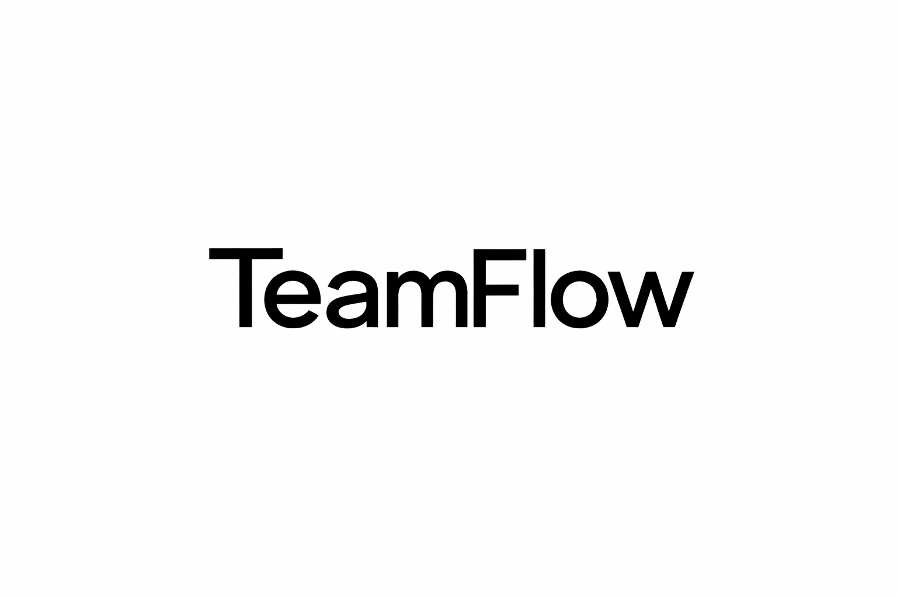

  

# TeamFlow

TeamFlow is a multi-tenant SaaS-style Agile Workspace backend built with NestJS. It provides organization-based isolation, role-driven access control, project boards, task workflows, sprint management, and analytics.
